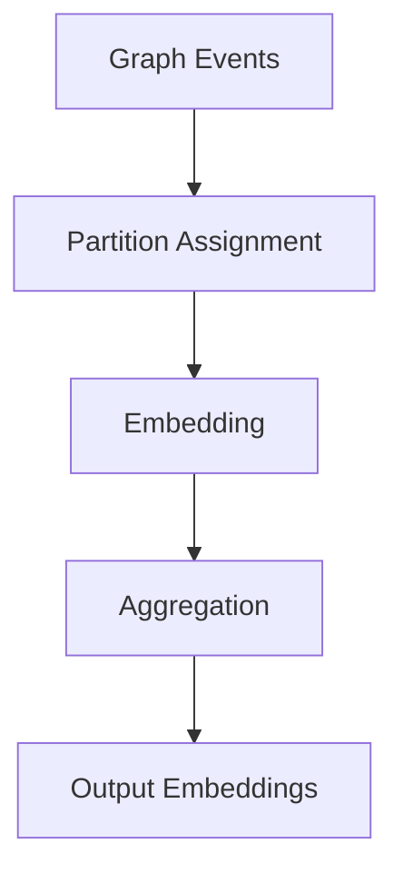

# Introduction 

<!-- citation example [@apache_software_foundation_zookeeper_2011] -->

A graph is a mathematical structure consisting of vertices (or nodes) connected by edges. Graphs are widely used to model relationships and interactions in various domains [@van_der_hofstad_random_2024], such as social networks [@leskovec_signed_2010] [@backstrom_group_2006] [@rozemberczki_twitch_2021], collaboration networks [@savic_analysis_2017], terrorist networks [@krebs_mapping_2002] and blog citation networks [@adamic_political_2005]. In these applications, the relationships between entities can be represented as edges connecting the corresponding vertices.

<!-- objasniti sta su realni grafovi i raspodelu stepeni kod njih kao i Watt-Strogatz princip -->

In many real-world graphs, the degree distribution follows a power-law, meaning that a small number of vertices have a very high degree (i.e., they are connected to many other vertices), while most vertices have a low degree. This characteristic is often observed in social networks, where a few individuals (e.g., celebrities) have many connections, while the majority of users have relatively few connections.

In real graphs, there are several properties that are often observed [@watts_collective_1998] [@zachary_information_1977] [@albert_statistical_2002]:
- **Small-world property**: Most pairs of vertices can be connected by a short path, even in large graphs. This is often referred to as the "six degrees of separation" phenomenon. [@watts_collective_1998]
- **Community structure**: Vertices tend to form clusters or communities, where vertices within the same community are more densely connected than those in different communities. This property is prevalent in social networks, where groups of friends or colleagues often form tightly-knit communities. [@leskovec_community_2009]
- **Scale-free property**: The degree distribution of the graph follows a power-law, meaning that a few vertices have a very high degree, while most vertices have a low degree. This is often observed in social networks, where a small number of individuals (e.g., celebrities) have many connections, while the majority of users have relatively few connections. [@barabasi_emergence_1999]

Graph vertex embeddings are a powerful technique for representing vertices in a graph as low-dimensional vectors, enabling various machine learning tasks such as vertex classification, link prediction [@leskovec_predicting_2010], and community detection. The effectiveness of these embeddings often depends on the underlying graph structure and the methods used to generate them. When faced with large graphs, the challenge of efficiently computing these embeddings while preserving the graph's structural properties becomes paramount. 

Distributed graph embedding methods such as dynamic Node2Vec [@lombardo_scalable_2019] [@mahdavi_dynnode2vec_2018] variants enable scalable representation learning on large, evolving graphs. However, in dynamic settings with online node arrivals, a fundamental systems problem arises: how to assign newly arriving nodes to partitions before sufficient structural or embedding information is available.

Most existing distributed embedding systems assume either:

* static partitioning [@benlic_effective_2010] [@sanders_distributed_2012], or
* immediate assignment based on incomplete information [@ugander_balanced_2013].

This leads to a practical trade-off between early partition assignment (low latency) and informed partition assignment (higher embedding quality and partition balance). Despite its practical relevance, this trade-off has not been systematically studied in the context of dynamic graph embedding.

# Problem Formulation

Given a dynamic graph where nodes arrive online and a distributed dynamic Node2Vec-style embedding model is maintained, how should partitions be assigned to new nodes to balance:

* embedding quality,
* partition balance,
* assignment latency

This paper aims to empirically study and characterize the trade-offs between delayed and immediate partition assignment strategies for online node arrivals in distributed dynamic graph embedding systems.
Rather than proposing a new embedding model, the focus is on partition assignment heuristics and their systemic impact.

## Related work 

Graph vertex embedding is a well-studied area, with various methods proposed to generate low-dimensional representations of nodes in a graph. State of the art method which is widely used is Node2Vec [@grover_node2vec_2016] which uses random walks to capture the local and global structure of the graph. Node2Vec generates embeddings by performing biased random walks on the graph, allowing it to explore both local and global structures. The method has been shown to be effective in capturing community structures and generating meaningful embeddings for various machine learning tasks. As its improvement, DistGER [@fang_distributed_2023] is a distributed graph embedding method that extends Node2Vec by leveraging distributed computing to handle large graphs. DistGER uses a similar random walk approach but optimizes walk sampling in order to maximize the information gain when selecting the next vertex to visit. 

Another approach to scale Node2Vec is proposed in [@lombardo_scalable_2019] which is based on actor model and uses a distributed framework to generate embeddings for large graphs. This method allows for parallel processing of random walks, significantly improving the efficiency of embedding generation in terms of time and resource usage.

The common ground for these methods is that they generate walks which are later used to train Word2Vec model [@church_word2vec_2017] commonly used for generating embeddings in natural language processing tasks. 

During the learning process, there are several state of the art approaches to parallelize the training of word2vec model. Commonly used approach in distributed environment is ensemble learning [@ji_ensemble_2007] which combines multiple smaller models to create a larger model. Final mode is created by aggregating smaller models using parameter server architecture [@li_parameter_2013]. 

The main challenge to address the problem of distributed graph vertex embedding is partitioning the graph in a way that preserves the community structure while ensuring that the partitions are balanced and can be processed efficiently in a distributed environment. Up until recently, most partitioning methods covered only small graphs or graphs without inherent community structure, like in [@benlic_effective_2010] [@sanders_distributed_2012] [@sanders_engineering_2011] [@romero_ruiz_memetic_2018] [@catalyurek_more_2023]. The main focus of these methods is static graph partitioning meaning that the graph is partitioned once and then used for processing. However, in many real-world applications, graphs are dynamic and change over time, requiring dynamic partitioning methods that can adapt to changes in the graph structure. In [@ugander_balanced_2013], a variant of label propagation algorithm is proposed for balancing partitions, but it lacks the ability to adapt to changes in the graph structure over time and it does not study the impact of partitioning on embedding quality.

For dynamic graph partitioning, there are several methods available in literature like [@nicoara_hermes_2015] [@huang_leopard_2016] [@xu_loggp_2014] and [@vaquero_adaptive_2013]. These methods focus on partitioning dynamic graphs by considering the changes in the graph structure over time and adapting the partitioning accordingly. However, these methods have not been used in embedding applications so far, and their effectiveness in generating high-quality embeddings in a distributed environment remains an open question. However, temporal graph embedding methods like [@mahdavi_dynnode2vec_2018] have been proposed to address the problem of dynamic graph embedding. These methods focus on generating embeddings for dynamic graphs by considering the temporal evolution of the graph structure. However, these methods do not address the problem of partitioning the graph in a distributed environment, which is crucial for efficient processing and scalability.

# Contributions

This paper makes the following contributions:

* We propose a systematic study of the trade-offs between delayed and immediate partition assignment strategies for online node arrivals in distributed dynamic graph embedding systems.
* We evaluate the impact of different partition assignment strategies on embedding quality, partition balance, and assignment latency, providing insights into the practical implications of these strategies in real-world scenarios.
* We provide empirical evidence and analysis of the trade-offs involved in partition assignment strategies, contributing to the understanding of how to effectively manage partitioning in distributed dynamic graph embedding systems.

## Paper organization

The rest of the paper is organized as follows: First, system overview is presented, then graph partitioning and embedding model are described. Next, benchmarks are explained in detail. Finally, results and discussion are presented, followed by the conclusion and references.

# Methods 

## System overview 

## Graph partitioning

## Embedding model

## Benchmarks

# Results and discussion

# Conclusion 

# References 

